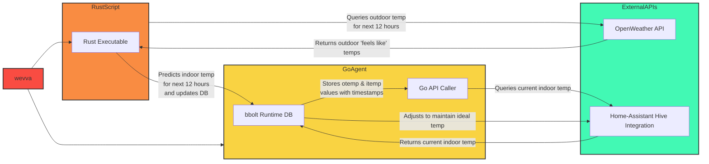

# wevva

A Hive integration for the Home Assistant App.

This project is my learning introduction to rust as a Go developer. 

## Overview

The mission for this Go/Rust project is to write a simple Go agent executable that will: 

1) Initialise a simple bbolt runtime db to:
- Store a set of otemp (outdoor temperature) & itemp (indoor temperature) values
- Organise these values by their subsequent 12 hour timestamps (from point of instantiation)
2) Run a rust executable that queries for the incoming 12-hour 'feels like' otemp values from the OpenWeatherAPI
3) Subsequently queries your home-assistant Hive integration to fetch the current indoor temperature
4) Predicts the indoor 'feels like' temperature over the course of the next 12 hours, and adjusts your hive thermostat via home assistant to maintain a specified temperature as accurately as possible. 

## High level diagram

